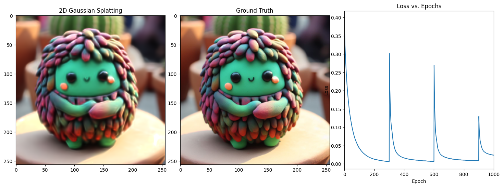
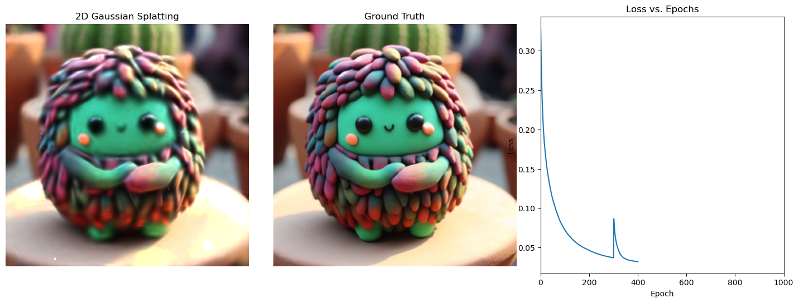

# TinySplat

A simple implementation of Gaussian splatting with [tinygrad](https://github.com/tinygrad/tinygrad). It works. I plan to add more features, see [TODO](#todo)

I started this to:

1. Learn Gaussian Splatting
2. Learn [tinygrad](https://docs.tinygrad.org/)

## Installation

To install all the necessary libraries to run all the examples use:

```bash
conda env create -f environment.yaml
```

> [!IMPORTANT]  
> There is a known bug on MacOS and conda (see this [issue](https://github.com/tinygrad/tinygrad/issues/2226) for details), please always use the following env variables before any notebook or when running commands.
>```bash
>%env METAL_XCODE=1
>%env DISABLE_COMPILER_CACHE=1
>```

## Benchmark

> MacBook Pro 2023 16GB RAM M2

| framework          | accelerator | time (min) | SSIM loss | number of iterations  | number of gaussian splats |
|--------------------|-------------|------------|-----------|-----------------------|---------------------------|
| Tinygrad (no JIT)  | MPS         | 1.58 min   | 0.033394  | 1000                  | 1000                      |
| Tinygrad (JIT)     | MPS         | 1.18 min   | 0.033394  | 1000                  | 1000                      |
| Tinygrad (JIT)     | MPS         | 13.29 min  | 0.012699  | 2000                  | 1000 + 3000               |
| Pytorch            | CPU         | ?          | ?         |  ?                    | 1000 + 4000(backup)       |
| Pytorch            | MPS         | 23.54 mins | 0.031974  | 400                   | 1000 + 4000(backup)       |

> RTX-3070 - AMD Ryzen 7 3800X 8-Core Processor - 32GB RAM

| framework          | accelerator | time (min) | SSIM loss | number of iterations  | number of gaussian splats |
|--------------------|-------------|------------|-----------|-----------------------|---------------------------|
| Tinygrad (no JIT)  | GPU         | 1.17 mins  | 0.034477  | 1000                  | 1000                      |
| Tinygrad (JIT)     | GPU         | 4.07 mins  | 0.034477  | 1000                  | 1000                      |
| Pytorch            | CPU         | ?          | ?         |  ?                    | 1000 + 4000(backup)       |
| Pytorch            | MPS         | ?          | ?         | 1000                  | 1000 + 4000(backup)       |
| Gsplat             | GPU         | 0.11 mins  | 0.006781  | 5000                  | 5000                      |

> [!NOTE]  
> I think there is some problem with Gsplat process...

## Usage

This repository is divided into subfolder each containing its own notebooks;

- for tinygrad refer to tinysplat
- for torch based refer to torchsplat - credits to (OutofAi)[https://github.com/OutofAi/2D-Gaussian-Splatting])

## Results

### Tinygrad no densification


### Tinygrad WITH STANDARD densification


### Tinygrad WITH gaussian blur densification



### Torch WITH densification



### GSPLAT


## TODO:

- [X] Densify the Gaussians in Tinygrad
- [X] Compare the speed with [Gsplat](https://docs.gsplat.studio/main/examples/image.html)
- [ ] Check if Gsplat is correctly configured!
- [ ] Make it more efficient in TinyGrad
- [ ] Implement the Gaussian Splatting in JAX (?)

## CREDITS

- 2D Gaussian Splatting original implementation: [OutofAi](https://github.com/OutofAi/2D-Gaussian-Splatting)
- GSplat implementation: [amazing guys](https://github.com/nerfstudio-project/gsplat)
