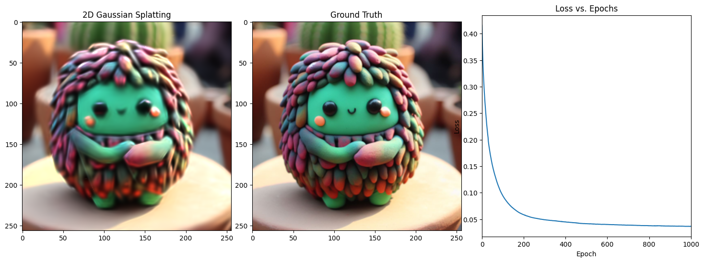

# TinySplat



This repository is the collection of different training script (mostly notebooks) to train simple Gaussians splats from 2D images for 2 reasons:

1. Understand the basic concepts of Gaussian splatting hands on
2. Implement the Gaussian Splatting in Tinygrad and get hands-on experience

## Benchmark

I am working on a MacbookPro M2 - 2023 therefore I will leave here the benchmarks of the time it takes for each Gaussian Splat to train:


<!-- Create a table  for benchmark -->

TEST on MacBook Pro 2023 16GB RAM
| framework          | accelerator | time (min) | SSIM loss | number of iterations  | number of gaussian splats |
|--------------------|-------------|------------|-----------|-----------------------|---------------------------|
| Tinygrad (no JIT)  | MPS         | 1.58 min   | 0.033394  | 1000                  | 1000                      |
| Tinygrad (JIT)     | MPS         | 1.18 min   | 0.033394  | 1000                  | 1000                      |
| Pytorch            | CPU         | > 50 mins  |           | 1000                  | 1000 + 4000(backup)       |
| Pytorch            | MPS         | > 50 mins  |           | 1000                  | 1000 + 4000(backup)       |

TEST on RTX-3070 
| framework          | accelerator | time (min) | SSIM loss | number of iterations  | number of gaussian splats |
|--------------------|-------------|------------|-----------|-----------------------|---------------------------|
| Tinygrad (no JIT)  | GPU         | 1.17 mins  | 0.034477  | 1000                  | 1000                      |
| Tinygrad (JIT)     | GPU         | 4.07 mins  | 0.034477  | 1000                  | 1000                      |


## Installation

Installation is not trivial on MacOS if you are using conda. 
Conda is broken for tinygrad, therefore use .venv follow this link if you want to know more about it: [link](https://github.com/tinygrad/tinygrad/issues/2226)

For installing Tinygrad, all you have to do is run the following:

```bash 
git clone https://github.com/tinygrad/tinygrad.git
cd tinygrad
python3 -m pip install -e .
```

For more information head to the tinygrad Documentation: [link](https://docs.tinygrad.org/)

To install the other dependencies, to run the original notebooks, run the following:

```bash
conda env create -f environment.yml
```

## Usage

For now there are 2 notebooks in the repository:

1. tinysplat.ipynb
2. 2D_Gaussian_Splatting.ipynb from the original repository [link](https://github.com/OutofAi/2D-Gaussian-Splatting)


## Results

### Tinygrad no densification


### Torch with densification


## TODO:

- [ ] Densify the Gaussians in Tinygrad
- [ ] Make it more efficient in TinyGrad
- [ ] Implement the Gaussian Splatting in JAX (?)
